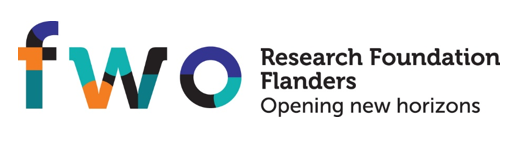

# Digital Caviar Solutions

## Components

Digital Caviar Solutions houses tools developed by Christophe Van
Neste and collaborators. The main focus is open source software for
medical research and translational applications.

The core packages for bioinformatics are:

- [genairics](https://github.com/dicaso/genairics): raw data analysis
- [bidali](https://github.com/dicaso/bidali): advanced processing and biological inference
- [pyni](https://github.com/dicaso/pyni): network inference package
- [leopard](https://github.com/dicaso/leopard): lab reporting package

A graphical user interface is under way, coined [pycassos](https://github.com/dicaso/pycassos).
For more information, see the [dicaso](https://github.com/dicaso github organization page.

## Visual overview and dependencies between the tools

<tr>
<td></td>
<td></td>
</tr>
</table>

